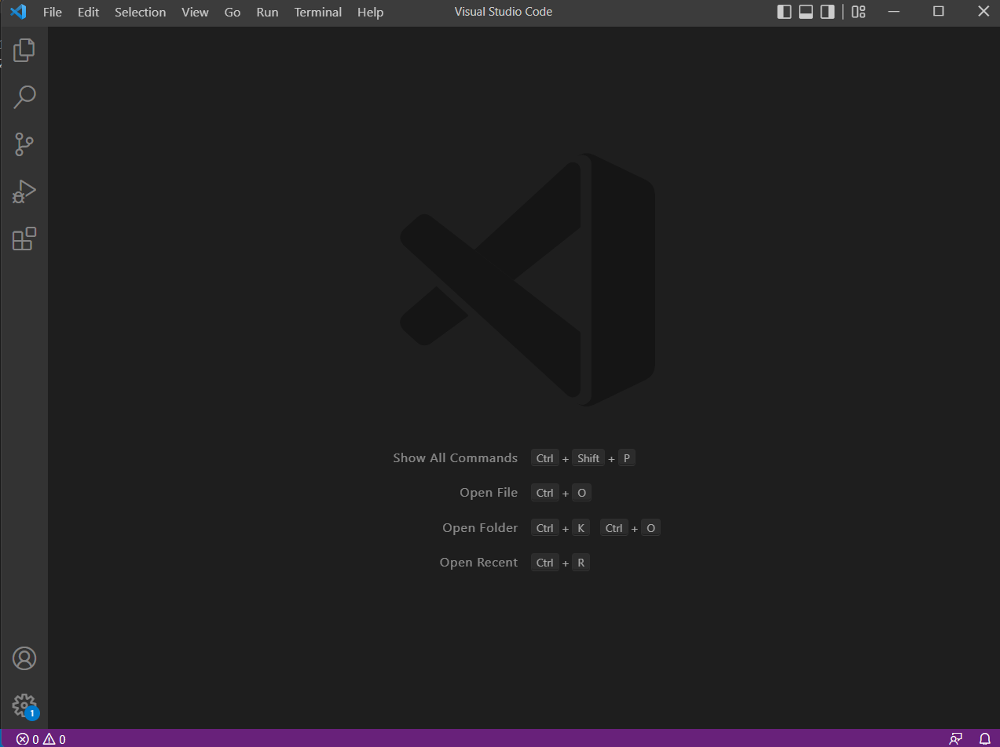

# Week 1 Lab Report
## 1. Installing VScode  
* Follow the instructions on the Visual Studio Code website to dowload and install VS Code on your device.
* Once it is installed, open it up. You should see something like this.  

## 2. Remotely Connecting  
* Now, we are going to connect to the remote computer. To do this, open a new terminal in VS Code and type in *ssh cs15lfa22zz@ieng6.ucsd.edu* but replace the zz with your own account letters.
* Enter the password and you are connected. Your computer is the client and then computer in the CSE basement is the server. You may see this.  

## 3. Trying Some Commands
* There are multiple commands you can try to run now.
* Try them both on your computer and on the remote computer after ssh-ing. Here is a screenshot.  
  
* As we can see, the cd command changes the current directory and the ls -lat command lists all of the files found in the current directory.
* The command cp /home/linux/ieng6/cs15lfa22/public/hello.txt copies the hello.txt file and the cat /home/linux/ieng6/cs15lfa22/public/hello.txt command prints its contents. 
## 4. Moving Files with scp
* scp allows you to copy files from your computer to a remote computer. It is run from the client. First compile and run the file with javac and java.
* In the terminal where the file is made, run *scp filename.java cs15lfa22zz@ieng6.ucsd.edu:~/* and enter the password.
* Log into ieng6 with ssh and use ls. Run the program on the ieng6 computer, again using javac and java. The terminals should look like this.  
  

## 5. Setting an SSH Key
* Next, we will use ssh keys to create a public and private key by running *ssh-keygen -t ed25519*.
* Follow the prompts and then copy the public key to the .ssh directory of the user account on the server.  
* On the server, enter *mkdir .ssh* and then on the client enter */Users/joe/.ssh/id_rsa.pub cs15lfa22@ieng6.ucsd.edu:~/.ssh/authorized_keys*, using your username and path. This copies the public key to the .ssh directory on the server. This new directory is created by the mkdir command. It allows us to ssh from the client to the server without having to enter our password.  
* Here is an example.  

## 6. Optimizing Remote Running
* First, I made an edit to the file WhereAmI.java.  
* Then, I scp'd it and logged into the server.
* The change showed after running javac and java. Here is the picture.  
  
* One way I optimized remote running was by running the javac and java command on the smae line, separated by a semi-colon. This reduced the time and number of lines of commands needed to compile and run the java program.