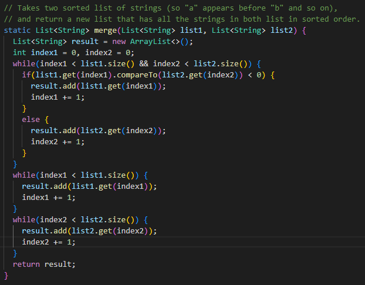

# Week 3 Lab Report

## Part 1: Simplest Search Engine  
Simplest Search Engine  
Code:  
````
import java.io.IOException;
import java.net.URI;
import java.util.ArrayList;

class Handler implements URLHandler {
    // The one bit of state on the server: a number that will be manipulated by
    // various requests.
    ArrayList<String> list = new ArrayList<>();

    public String handleRequest(URI url) {
        if (url.getPath().equals("/")) {
            return "Current list: " + list.toString();
        } else {
            System.out.println("Path: " + url.getPath());
            if (url.getPath().contains("/add")) {
                String[] parameters = url.getQuery().split("=");
                list.add(parameters[1]);
                return parameters[1] + " has been added.";
            }
            else if(url.getPath().contains("/search")) {
                String[] parameters = url.getQuery().split("=");
                String toSearch = parameters[1];
                String ret = "";
                for (int i=0; i<list.size(); i++) {
                    if (list.get(i).contains(toSearch)) {
                        ret = ret + list.get(i) + " ";
                    }
                }
                return ret;
            }
            return "404 Not Found!";
        }
    }
}

class SearchEngine {
    public static void main(String[] args) throws IOException {
        if(args.length == 0){
            System.out.println("Missing port number! Try any number between 1024 to 49151");
            return;
        }

        int port = Integer.parseInt(args[0]);

        Server.start(port, new Handler());
    }
}
````  

  
* methods called: handleRequest
* argument: localhost:4000/add?s=pineapple
* runs the if conditional in the first else statement
* since add is in the url, it determines what part of the query is the element that should be added to the list, adds it, and then says it has been added  

  
* methods called: handleRequest
* argument: localhost:4000/hello
* runs through all the if/else conditionals and determines it does not meet any of the conditions so returns a 404 error  

  
* methods called: handleRequest
* argument: localhost:4000/search?s=app
* runs the else if conditional in the else statement
* since search is in the url, it determines what part of the query is the element that should be searched for and returns every element of the list that contains it

  
* methods called: handleRequest
* argument: localhost:4000/
* runs the first if statement
* since the path consists of only /, it returns everything that is in the current list  


## Part 2: Debugging    
**ArrayExamples - averageWithoutLowest Bug**  

Failure-Inducing Input  
  
Symptom  
  
Fix  
  
As we can see with the first test for the averageWithoutLowest method, it failed to show a symptom of the bug and therefore, passed. The second test, however failed due to the bug which resulted from the fact that the method did not take into account if there were two lowest numbers. In other words, did the lowest number appear twice in the given array? In the second test, the given array has a lowest number of 2.0 which appears twice. The method, as a result, excludes both of these when calculating the sum of the doubles but then only excludes one of them when calculating the mean. Thus, an input of array {2.0, 4.0, 2.0} gives an average of 4.0/2 = 2.0 instead of (2.0+4.0)/2 = 3.0.  
To fix this, I created a new integer variable, index, set to 0 and used this to keep track of the index of lowest number that would be excluded from the sum. Then, in the for loop, I had it skip the sum step for the value at that index.  
  
**ListExamples - merge Bug**  

Failure-Inducing Input  
  
Symptom  
  
Fix  
  
Again, the second test failed while the first one passed. This is because of a minor bug in the merge method, even though it resulted in an infinite loop when I tried to test it (the infinite loop is represented by the .. in the Symptom photo -- I had to press Ctrl-C to exit it). This is caused by the last while loop in the method. The code would increment index1 by 1 each time the loop ran until index2 was greater than or equal to list2.size(). Since it was index1 being incremented instead of index2, this condition would never be met, resulting in a loop that would go on forever and whatever element in list2 at index2 to be repeatedly added to the merged list. I fixed this by updating index2 to increment by 1.