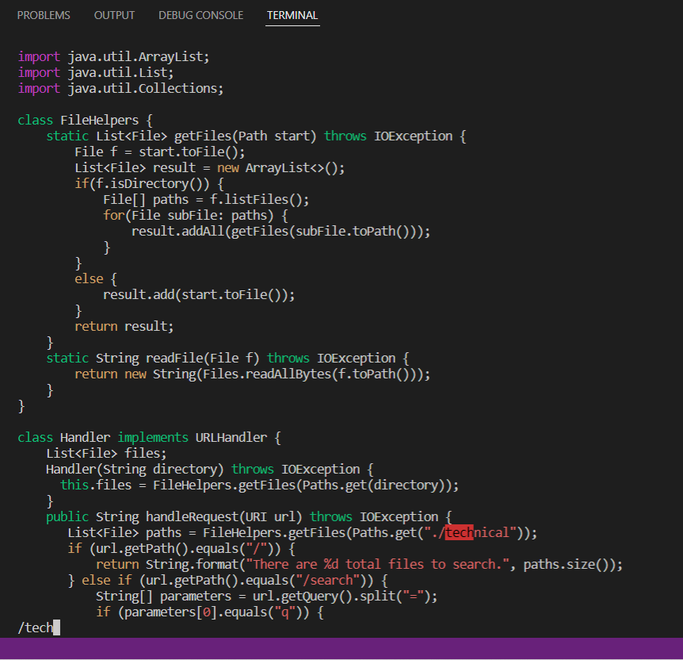
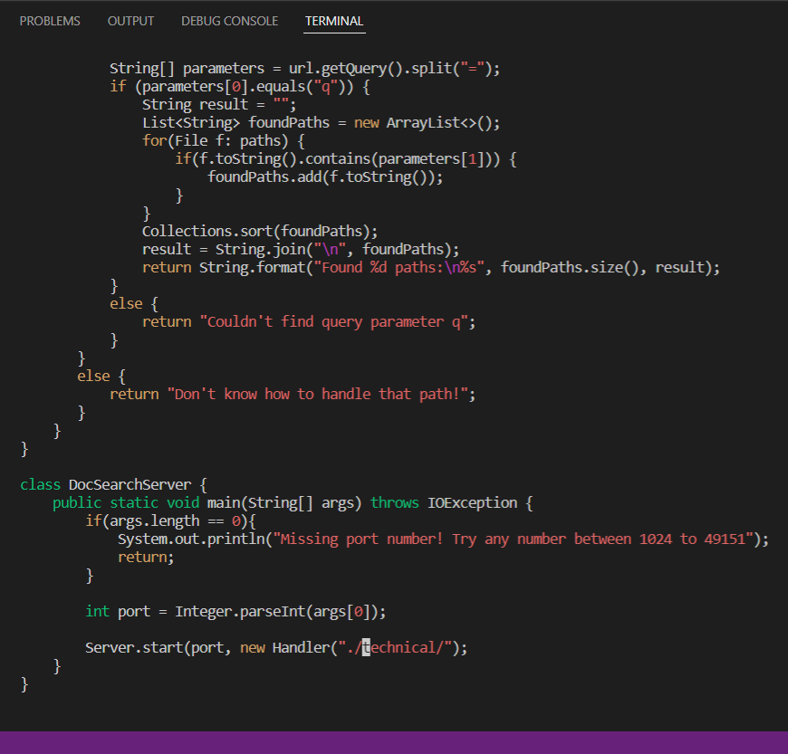
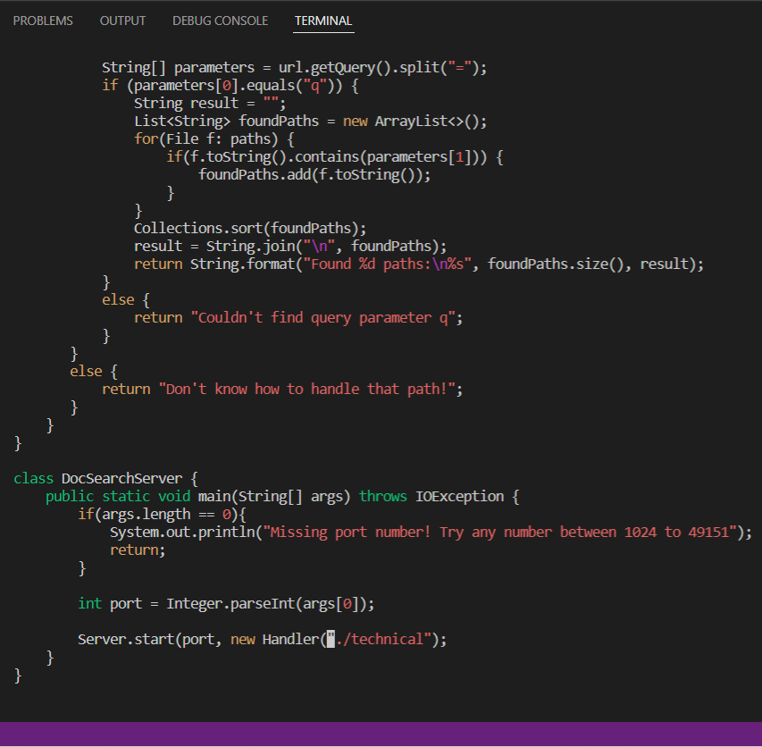
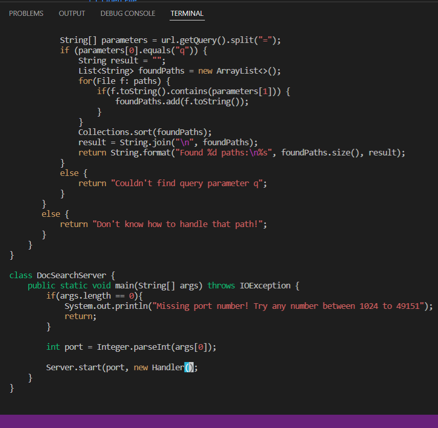
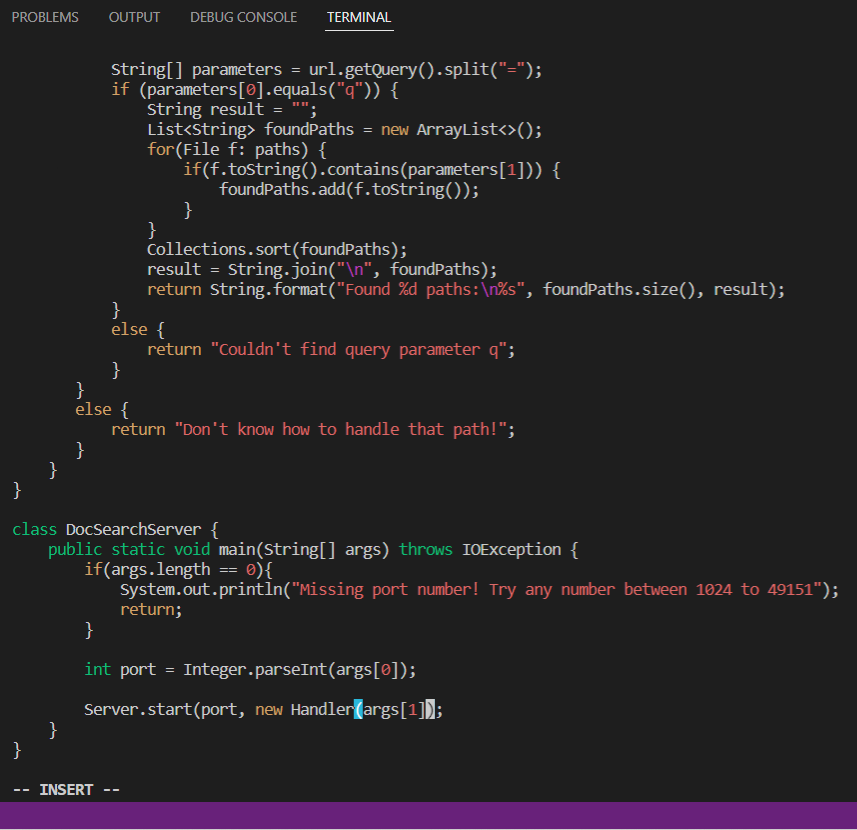
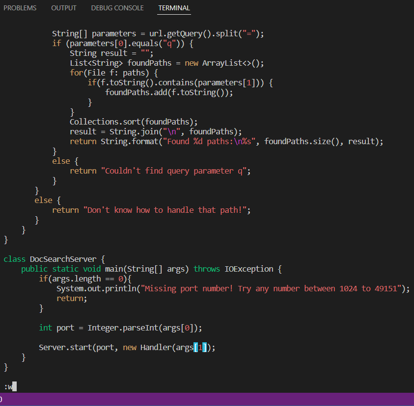

# Week 7 Lab Report

## Part 1: Vim change for skills demo   
Changing the main method to take a command-line argument  
```
/tech <enter> n h h h dw dw <delete> <delete> i args[1] <esc> :w <enter>
```
  
* commands: /tech
* searches for an occurrence of the phrase "tech" in the file

  
* commands: enter, n
* goes to the second instance of the phrase "tech" in the file

  
* commands: h
* moves the cursor left 3 times

  
* commands: dw, delete
* deletes the phrase "./technical"

  
* commands: i, args[1]
* inserts args[1] where the cursor is at

  
* command: esc, :w
* exits insert mode and saves the changes

## Part 2: Comparing vim with scp  
scp: 55 seconds (no difficulties)  
vim: 62 seconds (no difficulties)  

Which of these two styles would you prefer using if you had to work on a program that you were running remotely, and why?  
I may prefer scp'ing the file if it is not too big because I find it easier to edit it normally than through vim. This, however, is probably because I do not yet have too much practice with vim so remembering what keys to press takes a little longer than it usually would.

What about the project or task might factor into your decision one way or another? (If nothing would affect your decision, say so and why!)  
I think the size of the file that I am trying to work on and run remotely would affect my decision. If the file is big, scp'ing it over to run remotely would take longer so doing it through vim would be faster.