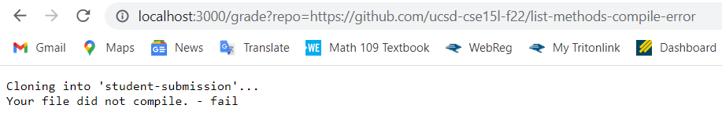
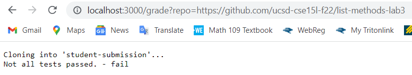
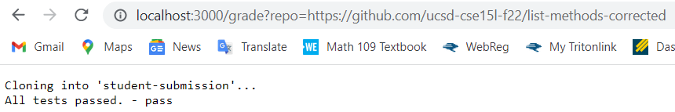

# Week 9 Lab Report

## grade.sh Code Block
```
rm -rf student-submission
git clone $1 student-submission

CP=".;../lib/hamcrest-core-1.3.jar;../lib/junit-4.13.2.jar"
cp TestListExamples.java student-submission
cd student-submission

#checks for file ListExamples.java
if [[ ! -f ListExamples.java ]] 
then
    echo "Make sure the correct file (and name) is submitted. - fail"
    exit 
fi
#echo "Correct file submitted."

#checks if file compiles
javac -cp $CP ListExamples.java 2> compiles.txt
if [[ -s compiles.txt ]]
then
    echo "Your file did not compile. - fail"
    exit
fi
#echo "Your file compiled."

#checks for correct method signature in merge method
if [[ $(grep -c "static List<String> merge(List<String> list1, List<String> list2)" ListExamples.java) -eq 0 ]]
then
    echo "Make sure the merge method has the correct signature. - fail"
    exit
fi

#checks for correct method signature in filter method
if [[ $(grep -c "static List<String> filter(List<String> list, StringChecker sc)" ListExamples.java) -eq 0 ]]
then
    echo "Make sure the filter method has the correct signature. - fail"
    exit
fi

#check if student implementation passes tests
javac -cp $CP TestListExamples.java
java -cp $CP org.junit.runner.JUnitCore TestListExamples > test_results.txt
if [[ $(grep -c "OK" test_results.txt) -eq 0 ]]
then
    echo "Not all tests passed. - fail"
    exit
fi
echo "All tests passed. - pass"
```

## Student Submission Screenshots
Compiler Error:  


Failed Tests:
  

Passed Tests:
  

## Trace for Compiler Error
rm -rf student-submission  
* standard output: file was successfully removed
* standard error: file was not removed

git clone $1 student-submission  
* standard output: Cloning into 'student-submission'...
* standard error: could not clone input into directory (maybe because a file with that name already exists there)

cp TestListExamples.java student-submission
* standard output: empty terminal (copies file into directory)
* standard error: could not copy file into directory (maybe because a file with that name already exists there)

cd student-submission
* standard output: changes directory into student-submission
* standard error: could not change directory (maybe because folder does not exist within directory)

javac -cp $CP ListExamples.java 2> compiles.txt
* standard output: empty terminal (compiles.txt will be empty since file was able to compile)
* standard error: empty terminal (error output saved into compiles.txt)

javac -cp $CP TestListExamples.java
* standard output: file was successfully compiled
* standard error: file was not able to compile

java -cp $CP org.junit.runner.JUnitCore TestListExamples > test_results.txt
* standard output: all tests pass (this is stored in test_results)
* standard error: at least one test failed (this is stored in test_results)

if [[ ! -f ListExamples.java ]]
* conditional is false since the file ListExamples.java exists in student-submission

if [[ -s compiles.txt ]]
* conditional is true since ListExamples.java was not able to compile because of a missing semicolon

if [[ $(grep -c "static List<String> merge(List<String> list1, List<String> list2)" ListExamples.java) -eq 0 ]]
* does not run

if [[ $(grep -c "static List<String> filter(List<String> list, StringChecker sc)" ListExamples.java) -eq 0 ]]
* does not run

if [[ $(grep -c "OK" test_results.txt) -eq 0 ]]
* does not run

Lines 14-17: does not run because conditional is false  
Lines 27-51: does not run because of early exit